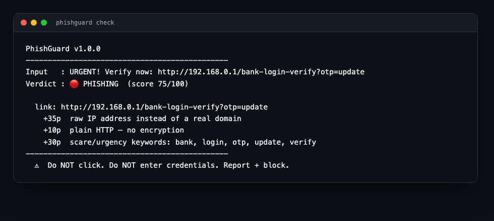
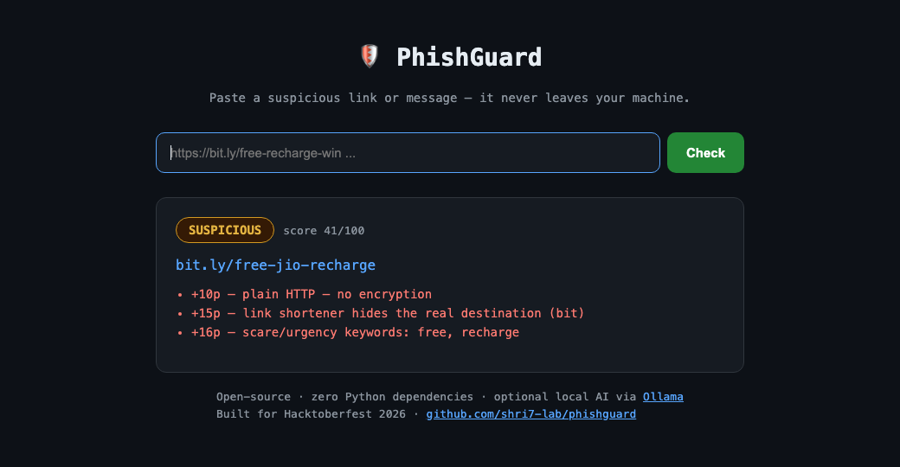

# 🛡️ PhishGuard

**Local-first phishing & scam link checker — built for a friend, in a Hacktoberfest weekend.**



> Paste a suspicious WhatsApp forward, a "your account will be suspended" SMS link, or a
> shady Discord DM into your terminal. PhishGuard scores it, explains *why* it's suspicious,
> and **your data never leaves your machine**.

```
$ python3 phishguard.py check "verify ur account here bit.ly/free-jio-recharge before it expires"

PhishGuard v1.1.0
----------------------------------------------
Input   : verify ur account here bit.ly/free-jio-recharge before it expires
Verdict : 🟠 SUSPICIOUS  (score 41/100)

  link: bit.ly/free-jio-recharge
    +10p  plain HTTP — no encryption
    +15p  link shortener hides the real destination (bit)
    +16p  scare/urgency keywords: free, recharge
----------------------------------------------
  ?  Verify with the sender on a trusted channel first.
```

## ✨ Features

- **Zero Python dependencies** — pure standard library. `git clone` and run.
- **Hybrid detection** — deterministic URL heuristics **+** an optional local open-source LLM
  (via [Ollama](https://ollama.com)) for the fuzzy "is this message a scam?" cases.
- **Explainable** — every point is itemized (+35p raw IP, +20p risky TLD, …) instead of a
  black-box score.
- **Advanced offline detection** — brand-spoof & homoglyph domains (`g00gle-login.com`,
  Cyrillic look-alikes), **hidden URLs inside base64/hex blobs**, and **display-name email
  spoofing** (`PayPal Security <secure@paypa1-support.xyz>`) — all without a single network call.
- **Tested** — 11 unit tests, stdlib `unittest` only (see below).
- **Privacy by design** — cloud checkers want you to paste the suspicious link into someone
  else's server. PhishGuard runs 100% on your laptop.
- **Browser demo included** — one command gives you a dark-themed web UI you can share with
  friends (or deploy for free on Render).
- **CI-friendly** — exits `1` on PHISHING verdict, so you can drop it into a git hook or pipeline.

## 🚀 Quick start

```bash
git clone https://github.com/shri7-lab/phishguard.git
cd phishguard

# heuristic engine only (works instantly, no install)
python3 phishguard.py check "https://account-verify-login.update.kyc-top.xyz/otp"

# message scan (WhatsApp/SMS forwards)
python3 phishguard.py check "Your IES college fee refund is pending. Claim now: bit.ly/x"

# JSON output for scripting
python3 phishguard.py check --json --no-ai "http://192.168.0.1/bank-login"

# browser demo
python3 phishguard.py web            # → http://localhost:8080

# shareable one-shot link (handy for WhatsApp-ing a verdict to a friend)
# http://localhost:8080/?q=<your-url-or-message>
```

## 🤖 Optional: add local AI

PhishGuard uses the LLM only as a second opinion on top of the rule engine.

```bash
# macOS
brew install ollama
# Linux
curl -fsSL https://ollama.com/install.sh | sh

ollama pull gemma3:2b        # ~300 MB, runs fine on 8 GB RAM
ollama serve                 # if not already running as a service
python3 phishguard.py check "send your OTP to 98xxxxxx to avoid account suspension"
```

Config via environment:

| Variable | Default | Purpose |
|---|---|---|
| `OLLAMA_HOST` | `http://localhost:11434` | Ollama API endpoint |
| `PHISHGUARD_MODEL` | `gemma3:2b` | any chat model you have pulled |
| `PHISHGUARD_NO_AI` | *(unset)* | set to `1` to force heuristics-only |
| `PORT` | `8080` | web demo port (Render sets this automatically) |

If Ollama isn't running, PhishGuard degrades gracefully to heuristic-only mode and tells you so.

## 🕵️ Detection signals

| Signal | Points |
|---|---|
| Raw IPv4 address instead of a domain | +35 |
| `@` embedded in URL (host-spoof trick) | +25 |
| Punycode / IDN (`xn--`) homograph host | +25 |
| Unicode look-alike characters in domain | +25 |
| Brand spoof (`paypal-secure.tk`, `g00gle-login.com`) | +25 |
| Display name says "PayPal", sender isn't | +25 |
| Hidden URL inside a base64/hex blob | +30 |
| High-risk TLD (`.zip` `.tk` `.xyz` `.top` …) | +20 |
| Link shortener (bit.ly, rb.gy, …) | +15 |
| Deep subdomains / long URL / extra port | +8…+15 |
| Urgency keywords (`otp`, `verify`, `suspend`, `refund` …) | up to +30 |
| Plain HTTP | +10 |
| Trusted brand domain (github.com, google.com …) | −25 |

**SAFE** < 30 · **SUSPICIOUS** 30–59 · **PHISHING** ≥ 60

## 🧪 Tests

11 tests, pure standard library — no pytest, no mocks, no network:

```bash
python3 -m unittest discover -s tests -v
```

## 🌐 Free live demo

```bash
python3 phishguard.py web --port 8080
```



**🌐 Live demo:** https://phishguard-oi4y.onrender.com (heuristic engine; AI runs locally)

One-click host: the repo ships a [`render.yaml`](render.yaml) blueprint — on Render:
**New → Blueprint → pick this repo → Deploy** (start command auto-set).

Deploy it on [Render](https://render.com) free tier: start command
`python3 phishguard.py web`, health check `/`. (The hosted demo runs the heuristic engine;
the full AI mode runs on your own machine — that's the point.)

## 📁 Project layout

```
phishguard/
├── phishguard.py   # the whole tool (CLI + web server), stdlib only
├── tests/          # 11 unittest cases — scoring, spoofing, hidden URLs
├── render.yaml     # one-click Render blueprint
├── ARTICLE.md      # DEV.to write-up draft
├── LICENSE         # MIT
└── README.md
```

## 🗺️ Roadmap

- [ ] Homoglyph visual-similarity check (Levenshtein against top-200 brands)
- [ ] QR-code decoding for "scan this" scam posters
- [ ] Browser extension wrapper
- [ ] Extractor for Indian UPI/vishing number patterns
- [ ] `pre-commit` hook mode

## 🤝 Contributing

Hacktoberfest-friendly: open an issue, claim it, send a PR. Good-first-issues label coming.

## 📜 License

MIT © Shriyansh Gupta

---

Built for **Hacktoberfest 2026 · DEV Weekend Challenge "Build for a Friend"**.
If a friend ever forwards you a sketchy link, this is for them too.
